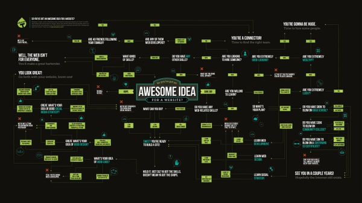
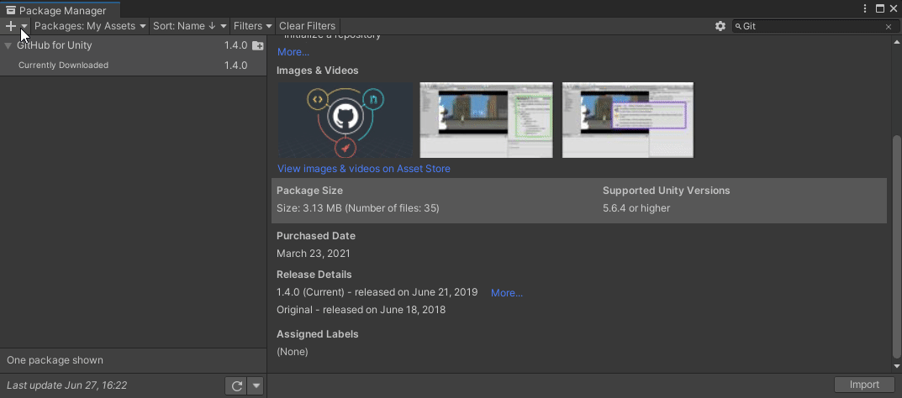

<!-- Header -->
<!--<h3 align="center">Project Title</h3>-->
<!--<h2 align="center">Project Description</h2>-->

<p align="center">
	'
	<br />
	<a href="https://github.com/JamesLaFritz/[package-name]/issues">Report Bug</a>
        ·
        <a href="https://github.com/JamesLaFritz/[package-name]/issues">Request Feature</a>
</p>

<!-- PROJECT SHIELDS -->
<p align="center">
  <a href="https://github.com/JamesLafritz/[package-name]/graphs/contributors">
	  
  </a>
  <a href="https://img.shields.io/github/forks/JamesLafritz/[package-name].svg?style=for-the-badge">
	  
  </a>
  <a href="https://github.com/JamesLafritz/2021DevEnviromentTemplate/stargazers">
	  
  </a>
  <a href="https://github.com/JamesLafritz/2021DevEnviromentTemplate/issues">
	  
  </a>
  <a href="https://img.shields.io/github/license/JamesLafritz/[package-name].svg?style=for-the-badge">
	  
  </a>
</p>

<!-- Links -->
<p align="center">
  <a href="https://jameslafritz.intensive.gamedevhq.com/">
	  
  </a>
  <a href="https://ktmarine1999.medium.com/">
	  
  </a>
  <a href="https://www.linkedin.com/in/james-lafritz/">
	  
  </a> 
  <a href="https://ktmarine1999.itch.io/">
	  
  </a> 
</p>


<!-- PROJECT LOGO -->
<p align="center">
  <a href="https://github.com/JamesLaFritz/2021DevEnviromentTemplate">
    
  </a>
</p>

<!-- TABLE OF CONTENTS -->
<details open="open">
  <summary><h2 style="display: inline-block">Table of Contents</h2></summary>
  <ol>
    <li>
      <a href="#about-the-project">About The Project</a>
      <ul>
        <li><a href="#built-with">Built With</a></li>
      </ul>
      <ul>
        <li><a href="#built-with">Built With</a></li>
      </ul>
      <ul>
        <li><a href="#installation">Articles</a></li>
      </ul>
    </li>
    <li><a href="#license">License</a></li>
    <li><a href="#acknowledgements">Acknowledgements</a></li>
  </ol>
</details>


<!-- ABOUT THE PROJECT -->
## About The Project



[Documentation](https://jameslafritz.github.io/[project-name])

Be sure to Edit replacing [package-name] every with project name


### Built With

* <a href="https://www.linkedin.com/in/james-lafritz/"></a>


<!-- Installation -->
### Installation
To install this into your project for modifications
Clone or Download the code from Git Hub into the Asset Folder of your project.
Change the Folder From GraphView Behavior Tree to mach what you wold like.
Edit all Files and change the NameSpace to match your new Folder Name. Do Not forget to change this in the UXML Documents as well. i.e "GraphViewBehaviorTree.Editor.SplitView"
Delete the Runtime/james.lafritz.GraphViewBehaviorTree and Editor/james.lafritz.GraphViewBehaviorTree.Editor Assembly Definition Files, Or Edit/Replace them with your own.

To use Template as is Use the Package manager to Install package from Git Hub. 
see [Creating custom packages for use in Unity](https://blog.devgenius.io/creating-custom-packages-for-use-in-unity-7dfbaa49e4b4)

* In Unity open the package manager
    * Go to Window->PackageManager
    * 
* Install this Package from git url
    * Click the Plus Drop down
    * Select "add package from git URL"
        * https://github.com/JamesLaFritz/[package-name].git
        * Select add
    * 


<!-- Articles -->
### Articles

[]()
[]()
[]()


<!-- ROADMAP -->
## Roadmap

See the [open issues](https://github.com/JamesLaFritz/[package-name]/issues) for a list of proposed features (and known issues).


<!-- LICENSE -->
## License

Distributed under the MIT License. See `LICENSE` for more information.


<!-- ACKNOWLEDGEMENTS -->
## Acknowledgements

* []()

## Welcome to GitHub Pages

You can use the [editor on GitHub](https://github.com/JamesLaFritz/2021DevEnviromentTemplate/edit/gh-pages/index.md) to maintain and preview the content for your website in Markdown files.

Whenever you commit to this repository, GitHub Pages will run [Jekyll](https://jekyllrb.com/) to rebuild the pages in your site, from the content in your Markdown files.

### Markdown

Markdown is a lightweight and easy-to-use syntax for styling your writing. It includes conventions for

```markdown
Syntax highlighted code block

# Header 1
## Header 2
### Header 3

- Bulleted
- List

1. Numbered
2. List

**Bold** and _Italic_ and `Code` text

[Link](url) and 
```

For more details see [Basic writing and formatting syntax](https://docs.github.com/en/github/writing-on-github/getting-started-with-writing-and-formatting-on-github/basic-writing-and-formatting-syntax).

### Jekyll Themes

Your Pages site will use the layout and styles from the Jekyll theme you have selected in your [repository settings](https://github.com/JamesLaFritz/2021DevEnviromentTemplate/settings/pages). The name of this theme is saved in the Jekyll `_config.yml` configuration file.

### Support or Contact

Having trouble with Pages? Check out our [documentation](https://docs.github.com/categories/github-pages-basics/) or [contact support](https://support.github.com/contact) and we’ll help you sort it out.

