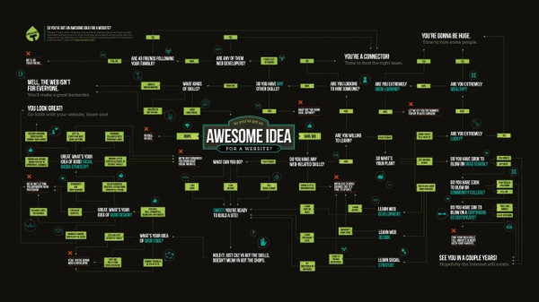

<!-- Header -->
<!--<h3 align="center">Project Title</h3>-->
<!--<h2 align="center">Project Description</h2>-->

	'
	 
	<a href="https://github.com/JamesLaFritz/TaskVSJobSystem/issues">Report Bug</a>
        ·
        <a href="https://github.com/JamesLaFritz/TaskVSJobSystem/issues">Request Feature</a>

<!-- PROJECT SHIELDS -->

  
  
  
  
  

<!-- Links -->

  
  
   
   

<!-- PROJECT LOGO -->

  

<!-- TABLE OF CONTENTS -->

  
<h2 style="display: inline-block">Table of Contents</h2>

  <ol>
    <li>
      <a href="#about-the-project">About The Project</a>
      <ul>
        <li><a href="#built-with">Built With</a></li>
      </ul>
      <ul>
        <li><a href="#built-with">Built With</a></li>
      </ul>
      <ul>
        <li><a href="#installation">Articles</a></li>
      </ul>
    </li>
    <li><a href="#license">License</a></li>
    <li><a href="#acknowledgements">Acknowledgements</a></li>
  </ol>

<!-- ABOUT THE PROJECT -->
## About The Project

[Documentation](https://jameslafritz.github.io/TaskVSJobSystem)

Shows How to use Await, Async, Tasks in Unity comparing their performance with Corutines, Wait, and Unity's C# Job System.

### Built With

* 

<!-- Installation -->
### Installation
To install this into your project for modifications
Clone or Download the code from Git Hub into.

<!-- Articles -->
### Articles

* 
* 
* 

<!-- ROADMAP -->
## Roadmap

See the [open issues](https://github.com/JamesLaFritz/[package-name]/issues) for a list of proposed features (and known issues).

<!-- LICENSE -->
## License

Distributed under the MIT License. See `LICENSE` for more information.

<!-- ACKNOWLEDGEMENTS -->
## Acknowledgements
* 
